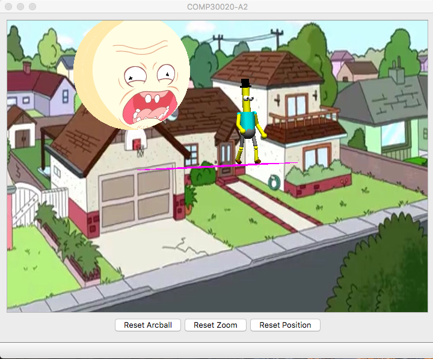

# Introduction
This is the repo for my final graphics assignment for COMP30020.  
A small but fun project that allowed a lot of freedom so I took the opportunity to make something humorous.

Sample output

# :ledger: Index
- [Introduction](#introduction)
- [:ledger: Index](#ledger-index)
- [:beginner: About](#beginner-about)
      - [Configuration](#configuration)
- [:electric_plug: Installation](#electricplug-installation)
- [:sunny: Usage](#sunny-usage)

# :beginner: About
Graphics project that features a character from Rick and Morty running around in a circle while other Rick and Morty images appear in the scene.

#### Configuration

#  :electric_plug: Installation
Qt is required for this project to run.  
Beware as well that Qt does take up 10+ Gb of space

# :sunny: Usage
Use the button `4` to begin the animation.  
The other buttons `1`, `2` and `3` toggle different layers of the output.